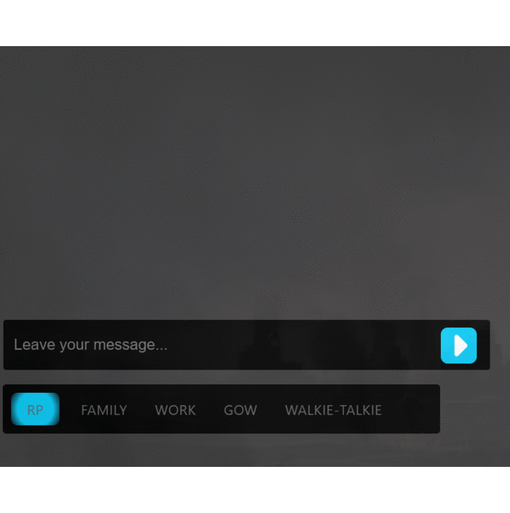

<h1 align="center">Interactive Chat System</h1>

This repository is a chat system designed for FiveM, utilizing React and Lua. It includes several useful utilities.

## Requirements

- [Node > v16](https://nodejs.org/en/)
- [Yarn](https://yarnpkg.com/getting-started/install) / [npm](https://docs.npmjs.com/cli/v10/commands/npm-install)

_A basic understanding of modern web development workflows. If you're unfamiliar with these, React might not be suitable for you at this stage._

## About The Project



This project is a small yet powerful interactive chat system designed for real-time communication. It features an input box that provides auto-suggestions as you type, making it easier and faster to send messages. The system displays sent messages above the input box, creating a seamless chat experience.

### Built With

This project was built with the following technologies:

- [React](https://react.dev/)
- [Typescript](https://www.typescriptlang.org/)

## Getting Started

To get a local copy up and running follow these simple example steps.

### Installation

Please follow the following steps for successful installation:

1. **Clone the Repository:** Get started by cloning the repository to your local machine.

   ```
   https://github.com/Ruminatesoftware/ChatSystem.git
   ```

2. **Install Packages:** Navigate to the directory and install the required yarn packages by executing the following command in your terminal:

   ```sh
   yarn install
   ```

3. **Run the Project:** Finally, enter the following command in your terminal to start your server:

   ```sh
   yarn start
   ```

   Now, your application should be successfully up and running!

## Features

This setup includes some utilities and examples to use as a foundation.

1. **Auto-Suggestions:** Get suggestions based on your input to speed up typing.

2. **Message Display:** Sent messages are displayed above the input box.

3. **User-Friendly Interface:** Clean and intuitive design for an easy user experience.

4. **Responsive Design:** Optimized for various screen sizes and devices.

## Contributing

Contributions are what make the open source community such an amazing place to learn, inspire, and create. Any contributions you make are **greatly appreciated**.

If you have a suggestion that would make this better, please fork the repo and create a pull request. You can also simply open an issue with the tag &quot;enhancement&quot;.
Don&#39;t forget to give the project a star! Thanks again!

1. Fork the Project
2. Create your Feature Branch (`git checkout -b feature/AmazingFeature`)
3. Commit your Changes (`git commit -m &#39;Add some AmazingFeature&#39;`)
4. Push to the Branch (`git push origin feature/AmazingFeature`)
5. Open a Pull Request

## License

Distributed under the [MIT license](LICENSE).

## Contact

If you have any questions or suggestions, feel free to reach out to us:

- Raise an issue on the repository: [GitHub Repository](https://github.com/Ruminatesoftware?tab=repositories)

## Acknowledgments

A special thanks to the following for their contributions, support and inspiration:

- [Ruminate Software](https://ruminate.gohero.us/)
